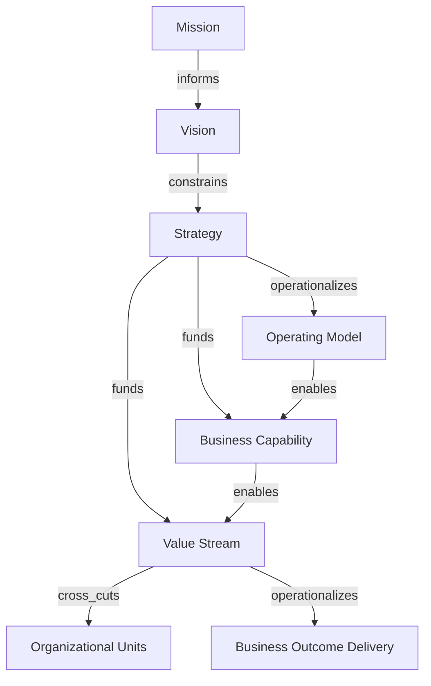

# Enterprise Foundations

This section models the enterprise foundation layer as intent nodes and structural translation nodes.

## Ontology Nodes

### Mission

- concept_type: cultural philosophy
- abstraction_layer: strategic layer
- semantic_role: enduring purpose claim about why the enterprise exists
- confidence: medium
- status: industry convention

### Vision

- concept_type: cultural philosophy
- abstraction_layer: strategic layer
- semantic_role: target future state that directional strategy attempts to realize
- confidence: medium
- status: industry convention

### Strategy

- concept_type: management discipline
- abstraction_layer: strategic layer, portfolio layer
- semantic_role: choice architecture for allocating attention, capital, and constraints toward desired outcomes
- confidence: high
- status: strongly established

### Operating Model

- concept_type: operating model
- abstraction_layer: organizational layer, product layer, operational layer
- semantic_role: repeatable pattern describing how the enterprise delivers value through coordinated work
- confidence: high
- status: strongly established

### Business Capability

- concept_type: capability
- abstraction_layer: organizational layer, product layer
- semantic_role: stable enterprise ability independent of org chart or specific tooling implementation
- confidence: high
- status: strongly established

### Value Stream

- concept_type: execution process
- abstraction_layer: product layer, operational layer, cross-cutting layer
- semantic_role: flow structure connecting intent, work, and stakeholder outcome
- confidence: high
- status: strongly established

## Semantic Edges

- mission -> informs -> vision
- vision -> constrains -> strategy
- strategy -> operationalizes -> operating_model
- strategy -> funds -> capabilities and value streams
- operating_model -> enables -> capability realization
- capability -> enables -> value_stream
- value_stream -> cross_cuts -> organizational units
- value_stream -> operationalizes -> business outcome delivery

## Competing Interpretations

- Practitioner convention: mission and vision are often collapsed into one leadership statement.
- Vendor convention: business capability is sometimes flattened into application capability or service catalog entries.
- Framework conflict: some EA approaches treat capability as structural, while some operating-model approaches treat it as planning vocabulary.
- Academic tension: value streams may be treated as process abstractions, economic chains, or customer-outcome pathways depending on discipline.

## Historical Evolution

- Mission and vision arose from strategic management and institutional purpose setting.
- Strategy emerged to discipline scarce-resource allocation under uncertainty and competition.
- Operating model became important when enterprises needed to distinguish declared strategy from actual delivery mechanics.
- Capability mapping emerged to create stable planning primitives less volatile than organization charts.
- Value streams emerged to make cross-functional flow visible where hierarchical charts obscured it.

## Mermaid Diagram

## Reconstructed Claim

- The true top layer of an enterprise is not a reporting hierarchy.
- It is an intent-to-execution translation stack made of mission, vision, strategy, operating model, capabilities, and value streams.
- These nodes belong to different abstraction layers and should not be forced into one parent-child ladder.

Related notes:

- [Mission, vision, strategy, and goals](mission-vision-strategy.md)
- [Operating models and capabilities](operating-models-and-capabilities.md)
- [Unified semantic relationship model](../13-model/unified-semantic-relationship-model.md)