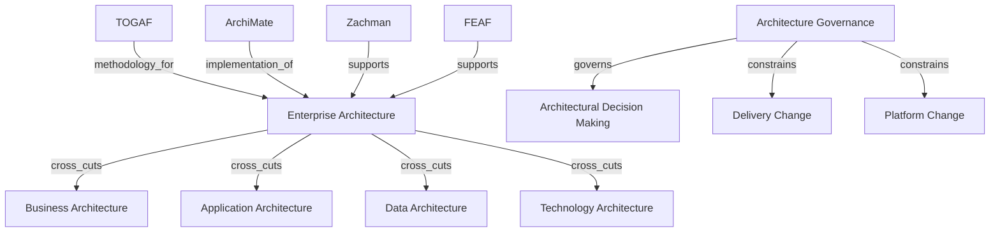

# Enterprise Architecture

Enterprise architecture is best modeled as a modeling-and-governance discipline rather than as a single box in a hierarchy.

## Ontology Nodes

### Enterprise Architecture

- concept_type: management discipline
- abstraction_layer: strategic layer, governance layer, cross-cutting layer
- semantic_role: coordination discipline for describing, evaluating, and steering relationships among business, application, data, and technology domains
- confidence: high
- status: strongly established

### TOGAF

- concept_type: framework
- abstraction_layer: governance layer, strategic layer
- semantic_role: architecture practice framework and method guidance
- confidence: high
- status: strongly established

### ArchiMate

- concept_type: architecture domain
- abstraction_layer: cross-cutting layer
- semantic_role: modeling language for expressing enterprise structures and relationships across domains
- confidence: high
- status: strongly established

### Zachman

- concept_type: framework
- abstraction_layer: strategic layer, governance layer
- semantic_role: classification schema for enterprise descriptive artifacts
- confidence: medium
- status: disputed

### FEAF

- concept_type: framework
- abstraction_layer: governance layer, strategic layer
- semantic_role: public-sector architecture framework and reference-model family
- confidence: medium
- status: industry convention

### Architecture Governance

- concept_type: governance model
- abstraction_layer: governance layer
- semantic_role: review and decision controls that constrain architectural change and standardization
- confidence: high
- status: strongly established

## Semantic Edges

- enterprise_architecture -> cross_cuts -> business architecture
- enterprise_architecture -> cross_cuts -> application architecture
- enterprise_architecture -> cross_cuts -> data architecture
- enterprise_architecture -> cross_cuts -> technology architecture
- togaf -> methodology_for -> enterprise_architecture
- archimate -> implementation_of -> enterprise_architecture modeling
- zachman -> supports -> enterprise_architecture classification
- feaf -> supports -> public-sector enterprise architecture
- architecture_governance -> governs -> architectural decision making
- architecture_governance -> constrains -> delivery and platform change

## Competing Interpretations

- Framework conflict: TOGAF is method plus framework, while ArchiMate is a language; teams often conflate them.
- Practitioner convention: enterprise architecture is sometimes used to mean current-state diagrams rather than an operating discipline.
- Vendor distortion: tooling vendors market repository features or diagrams as architecture itself.
- Academic tension: architecture may be treated as descriptive ontology, prescriptive design method, or governance regime depending on school.

## Historical Evolution

- Enterprise architecture emerged to coordinate enterprise-wide complexity beyond isolated system design.
- TOGAF emerged as a structured practice framework for architecture work.
- ArchiMate emerged to provide a consistent language for modeling cross-domain relationships.
- Governance became central as enterprises shifted from documenting systems to controlling change across federated technology estates.

## Mermaid Diagram

## Reconstructed Claim

- Enterprise architecture is not a simple architecture layer beneath strategy.
- It is a cross-cutting discipline plus governance system supported by frameworks, languages, and classification schemes.
- The confusion comes from mixing method, notation, and governance under the same label.

Related notes:

- [TOGAF and ArchiMate relation](togaf-archimate-zachman.md)
- [Governance graph](../03-governance/governance-graph.md)
- [Unified semantic relationship model](../13-model/unified-semantic-relationship-model.md)