# Governance Graph

Governance is the enterprise control graph for permission, constraint, evidence, and escalation.

## Ontology Nodes

### Governance

- concept_type: governance model
- abstraction_layer: governance layer, cross-cutting layer
- semantic_role: control structure that constrains and audits enterprise action
- confidence: high
- status: strongly established

### Compliance

- concept_type: governance model
- abstraction_layer: governance layer
- semantic_role: conformity system for external and internal obligations
- confidence: high
- status: strongly established

### Risk Management

- concept_type: management discipline
- abstraction_layer: governance layer, strategic layer
- semantic_role: uncertainty and downside exposure control system
- confidence: high
- status: strongly established

### Audit

- concept_type: management discipline
- abstraction_layer: governance layer
- semantic_role: evidence inspection and control verification process
- confidence: high
- status: strongly established

### Architecture Review Board

- concept_type: organizational_function
- abstraction_layer: governance layer
- semantic_role: decision body for architectural conformance and exceptions
- confidence: medium
- status: industry convention

### Change Advisory Board

- concept_type: organizational_function
- abstraction_layer: governance layer, operational layer
- semantic_role: change-risk approval body for operationally significant modifications
- confidence: medium
- status: industry convention

### Policy Enforcement

- concept_type: execution process
- abstraction_layer: governance layer, cross-cutting layer
- semantic_role: mechanism that turns governance rules into runtime or workflow constraints
- confidence: high
- status: strongly established

## Semantic Edges

- governance -> governs -> portfolios
- governance -> governs -> products
- governance -> governs -> delivery pipelines
- governance -> governs -> infrastructure
- compliance -> constrains -> execution
- risk_management -> constrains -> decision_interface
- audit -> audits -> governance evidence
- architecture_review_board -> governs -> architecture change
- change_advisory_board -> governs -> operational change
- policy_enforcement -> operationalizes -> governance rules
- policy_enforcement -> automates -> compliance controls

## Competing Interpretations

- Practitioner convention: governance is often treated as committee structure, which hides automation and evidence flows.
- Vendor convention: policy engines are marketed as governance even when they cover only enforcement.
- Framework conflict: some delivery frameworks describe governance as portfolio control, while operations frameworks describe it as change and risk control.

## Historical Evolution

- Governance expanded from financial oversight into technology, architecture, security, and delivery control.
- As release speed increased, governance shifted from manual gates toward policy automation and evidence collection.
- Federated technology estates forced governance to become graph-shaped because decisions now cross product, platform, and operational boundaries.

## Mermaid Diagram

```mermaid
flowchart TD
	governance[Governance]
	portfolios[Portfolios]
	products[Products]
	delivery_pipelines[Delivery Pipelines]
	infrastructure[Infrastructure]
	compliance[Compliance]
	execution[Execution]
	risk_management[Risk Management]
	decision_interface[Decision Interface]
	audit[Audit]
	governance_evidence[Governance Evidence]
	arb[Architecture Review Board]
	architecture_change[Architecture Change]
	cab[Change Advisory Board]
	operational_change[Operational Change]
	policy_enforcement[Policy Enforcement]
	governance_rules[Governance Rules]
	compliance_controls[Compliance Controls]

	governance -->|governs| portfolios
	governance -->|governs| products
	governance -->|governs| delivery_pipelines
	governance -->|governs| infrastructure
	compliance -->|constrains| execution
	risk_management -->|constrains| decision_interface
	audit -->|audits| governance_evidence
	arb -->|governs| architecture_change
	cab -->|governs| operational_change
	policy_enforcement -->|operationalizes| governance_rules
	policy_enforcement -->|automates| compliance_controls
```

## Reconstructed Claim

- Governance is not a child of any single enterprise layer.
- It is a cross-cutting control graph that constrains, audits, and operationalizes acceptable action across the enterprise.

Related notes:

- [Enterprise architecture](../02-architecture/enterprise-architecture.md)
- [Security cross-cutting layer](../09-security/security-cross-cutting.md)
- [Unified semantic relationship model](../13-model/unified-semantic-relationship-model.md)