# Portfolio, Product, Program, and Project

This section models funding, ownership, coordination, and delivery as separate but coupled systems.

## Ontology Nodes

### Portfolio Management

- concept_type: management discipline
- abstraction_layer: portfolio layer, strategic layer
- semantic_role: capital allocation and prioritization across strategic bets
- confidence: high
- status: strongly established

### Product Management

- concept_type: management discipline
- abstraction_layer: product layer
- semantic_role: outcome ownership for user value, problem selection, and product direction
- confidence: high
- status: strongly established

### Program Management

- concept_type: management discipline
- abstraction_layer: portfolio layer, product layer
- semantic_role: coordination layer for multiple related delivery streams
- confidence: high
- status: strongly established

### Project Management

- concept_type: management discipline
- abstraction_layer: engineering layer, organizational layer
- semantic_role: finite-scope planning and control for bounded delivery efforts
- confidence: high
- status: strongly established

### Platform Management

- concept_type: management discipline
- abstraction_layer: product layer, infrastructure layer
- semantic_role: ownership of shared enabling services and internal platform outcomes
- confidence: medium
- status: industry convention

## Semantic Edges

- portfolio_management -> funds -> products
- portfolio_management -> funds -> programs
- portfolio_management -> funds -> platforms
- product_management -> governs -> product direction
- product_management -> operationalizes -> value realization choices
- program_management -> enables -> multi-team coordination
- program_management -> cross_cuts -> products and projects
- project_management -> executes -> bounded delivery work
- platform_management -> enables -> many products and teams
- platform_management -> cross_cuts -> engineering and infrastructure

## Competing Interpretations

- Practitioner convention: product and project are often confused when organizations assign outcome ownership to delivery managers.
- Vendor convention: portfolio tooling often collapses program, project, epic, and product constructs into one backlog hierarchy.
- Framework conflict: scaled agile frameworks may re-map program constructs into trains or solution layers.

## Historical Evolution

- Portfolio management emerged from capital allocation and investment governance.
- Project management emerged to control bounded scope, schedule, and resource commitments.
- Product management rose as digital organizations shifted from project completion to continuous value ownership.
- Platform management emerged as shared internal products became strategic delivery enablers rather than infrastructure cost centers.

## Mermaid Diagram

```mermaid
flowchart TD
	portfolio_management[Portfolio Management]
	product_management[Product Management]
	program_management[Program Management]
	project_management[Project Management]
	platform_management[Platform Management]
	products[Products]
	programs[Programs]
	platforms[Platforms]
	product_direction[Product Direction]
	value_realization[Value Realization Choices]
	multi_team_coordination[Multi-Team Coordination]
	projects[Projects]
	bounded_delivery_work[Bounded Delivery Work]
	engineering[Engineering]
	infrastructure[Infrastructure]

	portfolio_management -->|funds| products
	portfolio_management -->|funds| programs
	portfolio_management -->|funds| platforms
	product_management -->|governs| product_direction
	product_management -->|operationalizes| value_realization
	program_management -->|enables| multi_team_coordination
	program_management -->|cross_cuts| products
	program_management -->|cross_cuts| projects
	project_management -->|executes| bounded_delivery_work
	platform_management -->|enables| products
	platform_management -->|enables| engineering
	platform_management -->|cross_cuts| engineering
	platform_management -->|cross_cuts| infrastructure
```

## Reconstructed Claim

- Funding, ownership, coordination, and execution are separate enterprise dimensions.
- Portfolio, product, program, project, and platform should not be arranged as a single descending tree.
- They are linked by funding, ownership, and coordination edges that cut across delivery structures.

Related notes:

- [Platform and infrastructure](../08-platform/platform-infrastructure.md)
- [Agile and delivery methodologies](../06-methodologies/agile-scrum-kanban-safe.md)
- [Unified semantic relationship model](../13-model/unified-semantic-relationship-model.md)