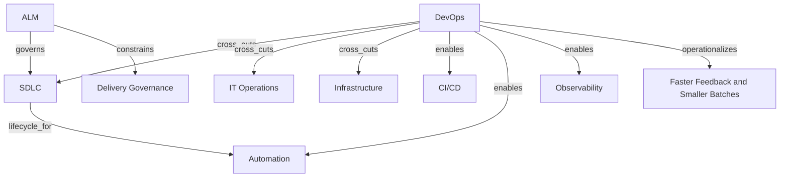

# ALM, SDLC, and DevOps

This page models the lifecycle cluster as ontology nodes and semantic edges rather than as a glossary.

## Ontology Nodes

### ALM

- concept_type: governance model
- abstraction_layer: governance layer, cross-cutting layer
- semantic_role: lifecycle governance over application change, release, maintenance, and control evidence
- confidence: medium
- status: disputed

### SDLC

- concept_type: lifecycle
- abstraction_layer: engineering layer
- semantic_role: execution lifecycle for software conception, build, test, release, operate, and maintain
- confidence: high
- status: strongly established

### DevOps

- concept_type: operating model
- abstraction_layer: cross-cutting layer, engineering layer, operational layer
- semantic_role: coordination model that couples delivery, operations, automation, and feedback loops
- confidence: high
- status: strongly established

## Semantic Edges

### Strongly established

- ALM -> governs -> SDLC
- DevOps -> cross_cuts -> SDLC
- DevOps -> cross_cuts -> IT operations
- DevOps -> cross_cuts -> infrastructure
- SDLC -> lifecycle_for -> software change and release work

### Common operational edges

- DevOps -> enables -> CI/CD
- DevOps -> enables -> automation
- DevOps -> enables -> observability
- DevOps -> operationalizes -> faster feedback and smaller batches
- ALM -> constrains -> delivery governance

### Do not collapse

- DevOps != CI/CD
- DevOps != release engineering
- DevOps != platform engineering
- DevOps != SRE

## Competing Interpretations

- Vendor convention: many platforms present ALM as a tool suite rather than a governance model.
- Practitioner convention: ALM is often used as an umbrella for application-centric lifecycle management.
- Academic and research convention: DevOps is usually treated as an organizational and socio-technical operating model, not a phase.
- Framework conflict: Scrum and Agile do not replace SDLC; they influence how work moves through SDLC stages.

## Historical Evolution

- ALM emerged to manage the full application change and maintenance lifecycle beyond coding.
- SDLC emerged as a structured response to chaotic software construction and quality risk.
- DevOps emerged as a response to siloed development and operations, slow handoffs, brittle releases, and weak feedback loops.
- Modern tooling blurred boundaries by packaging planning, code, build, release, security, and operations into one suite.

## Vendor Abstraction Distortion

- Azure DevOps bundles planning, repositories, pipelines, artifacts, and test management under one vendor surface.
- GitLab bundles planning, code, CI/CD, security, deployment, infrastructure, and monitoring.
- GitHub increasingly spans source control, actions, security, codespaces, and enterprise policy controls.
- These vendor surfaces collapse multiple conceptual layers into one product boundary and can make DevOps look like a tool category instead of an operating model.

## Graph Fragment

```yaml
nodes:
  - id: alm
    concept_type: governance_model
    layer: governance
  - id: sdlc
    concept_type: lifecycle
    layer: engineering
  - id: devops
    concept_type: operating_model
    layer: cross_cutting
edges:
  - from: alm
    to: sdlc
    type: governs
  - from: devops
    to: sdlc
    type: cross_cuts
  - from: devops
    to: it_operations
    type: cross_cuts
  - from: devops
    to: infrastructure
    type: cross_cuts
  - from: devops
    to: ci_cd
    type: enables
  - from: devops
    to: observability
    type: enables
```

## Mermaid Diagram



## Reconstructed Claim

- ALM is best modeled as governance over the application lifecycle.
- SDLC is the execution lifecycle for software work.
- DevOps is the cross-functional operating model that spans SDLC, operations, and infrastructure.
- This makes the enterprise graph multi-layered, not nested as a simple parent-child chain.

Related notes:

- [Agile and delivery methodologies](../06-methodologies/agile-scrum-kanban-safe.md)