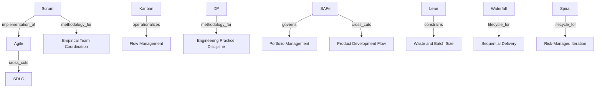

# Agile, Scrum, Kanban, XP, SAFe, Lean, Waterfall, Spiral

This page classifies delivery methodologies as ontology nodes rather than naming them descriptively.

## Ontology Nodes

### Agile

- concept_type: cultural philosophy
- abstraction_layer: cross-cutting layer, organizational layer
- semantic_role: values and principles for adaptive delivery, feedback, and responsiveness
- confidence: medium
- status: industry convention

### Scrum

- concept_type: framework
- abstraction_layer: engineering layer, team layer
- semantic_role: lightweight framework for complex work organized around empirical inspection and adaptation
- confidence: high
- status: strongly established

### Kanban

- concept_type: execution process
- abstraction_layer: operational layer, engineering layer
- semantic_role: flow management approach that visualizes work, limits WIP, and optimizes throughput
- confidence: medium
- status: industry convention

### XP

- concept_type: methodology
- abstraction_layer: engineering layer
- semantic_role: engineering practice set focused on code quality, feedback, and disciplined development techniques
- confidence: medium
- status: industry convention

### SAFe

- concept_type: framework
- abstraction_layer: portfolio layer, product layer, engineering layer, organizational layer
- semantic_role: enterprise scaling framework that coordinates portfolio, product development flow, technical agility, and leadership
- confidence: high
- status: strongly established

### Lean

- concept_type: cultural philosophy
- abstraction_layer: strategic layer, operational layer
- semantic_role: waste-reduction and flow-improvement philosophy
- confidence: medium
- status: industry convention

### Waterfall

- concept_type: lifecycle
- abstraction_layer: engineering layer
- semantic_role: sequential delivery model with phase progression
- confidence: medium
- status: industry convention

### Spiral

- concept_type: lifecycle
- abstraction_layer: engineering layer
- semantic_role: risk-driven iterative delivery model
- confidence: medium
- status: industry convention

## Semantic Edges

- Agile -> cross_cuts -> SDLC
- Scrum -> methodology_for -> empirical team coordination
- Scrum -> implementation_of -> Agile principles
- Kanban -> operationalizes -> flow management
- XP -> methodology_for -> engineering practice discipline
- SAFe -> governs -> scaled coordination across portfolio and delivery layers
- Lean -> constrains -> waste and batch size
- Waterfall -> lifecycle_for -> sequential delivery
- Spiral -> lifecycle_for -> risk-managed iteration

## Competing Interpretations

- Practitioner convention: Agile is sometimes used as a synonym for Scrum, which is imprecise.
- Vendor convention: tools often market boards, backlogs, and pipelines as Agile itself.
- Framework conflict: Scrum is a framework, not a methodology, even though many teams use it like one.
- SAFe conflict: some practitioners treat SAFe as an operating model, while the official framing is a framework.

## Historical Evolution

- Agile emerged as a response to heavyweight predictive methods and poor responsiveness to change.
- Scrum emerged to operationalize empiricism for complex product work.
- Kanban emerged from manufacturing flow control and was adapted for knowledge work.
- XP emerged to improve engineering discipline and quality under fast-changing requirements.
- SAFe emerged to coordinate agile delivery across large enterprises and multiple teams.

## Vendor Abstraction Distortion

- Jira often turns Agile into board configuration and issue-state management.
- Azure DevOps often turns Agile into work item hierarchy and sprint tooling.
- GitLab and GitHub can absorb Agile planning into broader delivery surfaces.
- This causes a category error where tool configuration is mistaken for methodology.

## Graph Fragment

```yaml
nodes:
  - id: agile
    concept_type: cultural_philosophy
    layer: cross_cutting
  - id: scrum
    concept_type: framework
    layer: team
  - id: safe
    concept_type: framework
    layer: portfolio
edges:
  - from: agile
    to: scrum
    type: implementation_of
  - from: agile
    to: sdlc
    type: cross_cuts
  - from: scrum
    to: complex_work
    type: methodology_for
  - from: safe
    to: portfolio_management
    type: governs
  - from: safe
    to: product_development_flow
    type: cross_cuts
```

## Mermaid Diagram



## Reconstructed Claim

- Agile is a cross-cutting philosophy, not a lifecycle.
- Scrum is a framework for empirical team execution.
- SAFe is a scaling framework that changes enterprise topology.
- These concepts modify how work flows through SDLC rather than replacing SDLC.