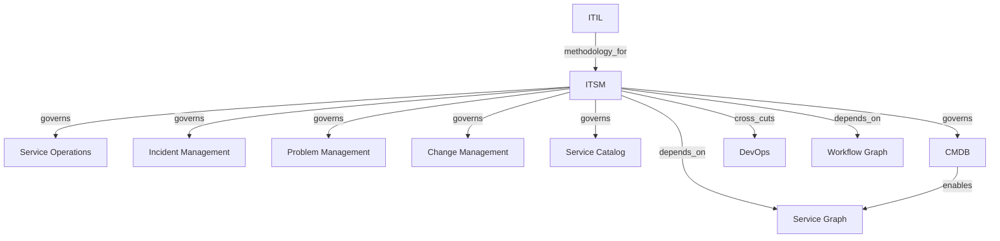

# ITSM and ITIL

This page models service management as an operational control system, not as a descriptive taxonomy.

## Ontology Nodes

### ITSM

- concept_type: management discipline
- abstraction_layer: operational layer, governance layer, cross-cutting layer
- semantic_role: service delivery and support control system for incidents, requests, changes, problems, and service configuration
- confidence: high
- status: strongly established

### ITIL

- concept_type: framework
- abstraction_layer: governance layer, operational layer
- semantic_role: best-practice framework for service management operating controls and service value flows
- confidence: medium
- status: industry convention

## Semantic Edges

- ITIL -> methodology_for -> ITSM
- ITSM -> governs -> service operations
- ITSM -> governs -> incident management
- ITSM -> governs -> problem management
- ITSM -> governs -> change management
- ITSM -> governs -> service catalog
- ITSM -> governs -> CMDB
- ITSM -> cross_cuts -> DevOps
- ITSM -> depends_on -> service graph and workflow graph

## Competing Interpretations

- Practitioner convention: ITSM is often treated as the operational layer of IT service governance.
- Vendor convention: ServiceNow often presents ITSM as one product family inside a wider platform graph.
- Academic distinction: ITSM is a management discipline, while ITIL is a guidance framework.
- Tooling distortion: the CMDB and service graph can make service relationships appear identical to process workflows when they are not.

## Historical Evolution

- ITSM emerged to standardize service support and operational reliability in enterprise IT.
- ITIL emerged to codify service management best practices.
- Modern cloud and DevOps practices forced ITSM to coexist with faster change, automation, and federated ownership.

## Vendor Abstraction Distortion

- ServiceNow collapses service management, workflow automation, CMDB, and service mapping into one operational platform boundary.
- This can make ITSM look like a software product rather than an enterprise control discipline.

## Graph Fragment

```yaml
nodes:
  - id: itsm
    concept_type: management_discipline
    layer: operational
  - id: itil
    concept_type: framework
    layer: governance
  - id: cmdb
    concept_type: platform_abstraction
    layer: operational
edges:
  - from: itil
    to: itsm
    type: methodology_for
  - from: itsm
    to: incident_management
    type: governs
  - from: itsm
    to: change_management
    type: governs
  - from: itsm
    to: devops
    type: cross_cuts
  - from: cmdb
    to: service_graph
    type: enables
```

## Mermaid Diagram



## Reconstructed Claim

- ITSM is an operational governance discipline for services.
- ITIL is a framework for service management practice.
- ServiceNow is a vendor abstraction that blends workflow, service graph, and operational control into one platform surface.

Related notes:

- [Governance graph](../03-governance/governance-graph.md)
- [ALM, SDLC, and DevOps](../05-lifecycle/alm-sdlc-devops.md)
- [Vendor ecosystem mapping](../10-vendors/vendor-ecosystem.md)
- [Enterprise master map](../15-master-map/enterprise-master-map.md)