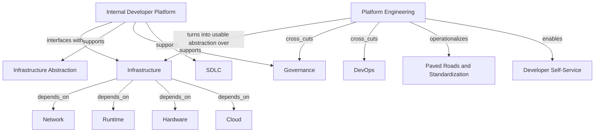

# Platform and Infrastructure

This page separates dependency substrate from platform abstraction.

## Ontology Nodes

### Infrastructure

- concept_type: technical platform abstraction
- abstraction_layer: infrastructure layer
- semantic_role: compute, network, storage, runtime, and environmental dependency substrate
- confidence: high
- status: strongly established

### Platform Engineering

- concept_type: operating model
- abstraction_layer: cross-cutting layer, infrastructure layer, engineering layer
- semantic_role: internal platform product and operating model that standardizes delivery paths and self-service capabilities
- confidence: high
- status: strongly established

### Internal Developer Platform

- concept_type: technical platform abstraction
- abstraction_layer: cross-cutting layer, infrastructure layer, engineering layer
- semantic_role: abstraction layer that unifies developer workflows, golden paths, controls, and tooling
- confidence: high
- status: industry convention

## Semantic Edges

- infrastructure -> depends_on -> cloud, hardware, runtime, network
- platform_engineering -> enables -> developer self-service
- platform_engineering -> operationalizes -> standardization and paved roads
- internal_developer_platform -> supports -> SDLC
- internal_developer_platform -> supports -> governance automation
- internal_developer_platform -> supports -> infrastructure abstraction
- platform_engineering -> cross_cuts -> DevOps
- platform_engineering -> cross_cuts -> governance

## Competing Interpretations

- Practitioner convention: platform engineering is both a product discipline and an operating model.
- Vendor convention: cloud platforms often rebrand infrastructure services as a platform layer.
- Academic and community convention: internal developer platforms are socio-technical abstractions, not just tooling stacks.

## Historical Evolution

- Infrastructure began as the base dependency layer for compute and connectivity.
- Cloud computing abstracted infrastructure provisioning.
- Platform engineering emerged to reduce cognitive load and standardize delivery across teams.
- Internal developer portals and platforms emerged to unify catalogs, templates, docs, and service ownership.

## Vendor Abstraction Distortion

- Backstage presents itself as a developer portal framework, but functionally it often becomes the front door to an internal platform graph.
- Cloud vendors blur runtime, infrastructure, identity, and policy into one platform surface.
- This can make platform engineering appear to be a tool installation when it is actually an organizational and operational design choice.

## Graph Fragment

```yaml
nodes:
  - id: infrastructure
    concept_type: technical_platform_abstraction
    layer: infrastructure
  - id: platform_engineering
    concept_type: operating_model
    layer: cross_cutting
  - id: idp
    concept_type: technical_platform_abstraction
    layer: cross_cutting
edges:
  - from: platform_engineering
    to: infrastructure
    type: operationalizes
  - from: idp
    to: sdlc
    type: enables
  - from: idp
    to: governance
    type: automates
  - from: infrastructure
    to: devops
    type: supports
```

## Mermaid Diagram



## Reconstructed Claim

- Infrastructure is the dependency substrate.
- Platform engineering is the operating model that turns infrastructure into usable abstraction.
- Internal developer platforms are the cross-cutting delivery interface over infrastructure, controls, and workflow.