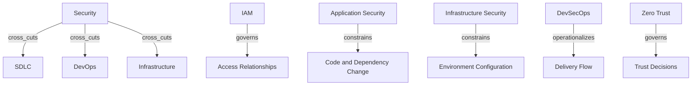

# Security Cross-Cutting Layer

Security is a cross-cutting control, assurance, and resilience system.

## Ontology Nodes

### Security

- concept_type: governance model
- abstraction_layer: cross-cutting layer, governance layer
- semantic_role: enterprise control system for confidentiality, integrity, availability, and resilience
- confidence: high
- status: strongly established

### IAM

- concept_type: architecture_domain
- abstraction_layer: cross-cutting layer, infrastructure layer
- semantic_role: identity, authentication, authorization, and entitlement control domain
- confidence: high
- status: strongly established

### Application Security

- concept_type: architecture_domain
- abstraction_layer: engineering layer, cross-cutting layer
- semantic_role: security controls over code, dependencies, testing, and release artifacts
- confidence: high
- status: strongly established

### Infrastructure Security

- concept_type: architecture_domain
- abstraction_layer: infrastructure layer, cross-cutting layer
- semantic_role: protection and hardening of runtime, network, compute, and configuration environments
- confidence: high
- status: strongly established

### DevSecOps

- concept_type: operating model
- abstraction_layer: engineering layer, operational layer, cross-cutting layer
- semantic_role: integration of security controls into delivery and operational workflows
- confidence: high
- status: industry convention

### Zero Trust

- concept_type: governance model
- abstraction_layer: cross-cutting layer, governance layer
- semantic_role: security strategy based on explicit verification, least privilege, and breach assumption
- confidence: high
- status: strongly established

## Semantic Edges

- security -> cross_cuts -> SDLC
- security -> cross_cuts -> DevOps
- security -> cross_cuts -> infrastructure
- iam -> governs -> access relationships
- application_security -> constrains -> code and dependency change
- infrastructure_security -> constrains -> environment configuration
- devsecops -> operationalizes -> security in delivery flow
- zero_trust -> governs -> identity, endpoint, application, network, infrastructure, and data trust decisions

## Competing Interpretations

- Vendor convention: security products are marketed as complete security strategies when they are only one control family.
- Practitioner convention: DevSecOps is sometimes treated as a toolchain, sometimes as an operating model.
- Framework conflict: Zero Trust is described as a strategy, but many teams wrongly reduce it to network segmentation.

## Historical Evolution

- Security began as perimeter and access control, then expanded into application, infrastructure, and identity domains.
- DevSecOps emerged as delivery velocity made externalized security review too slow and brittle.
- Zero Trust emerged as distributed systems and cloud environments made implicit network trust untenable.

## Mermaid Diagram

## Reconstructed Claim

- Security is not a child of development, operations, or infrastructure.
- It is a cross-cutting governance and architecture system that constrains all three simultaneously.

Related notes:

- [ALM, SDLC, and DevOps](../05-lifecycle/alm-sdlc-devops.md)
- [Governance graph](../03-governance/governance-graph.md)
- [Unified semantic relationship model](../13-model/unified-semantic-relationship-model.md)