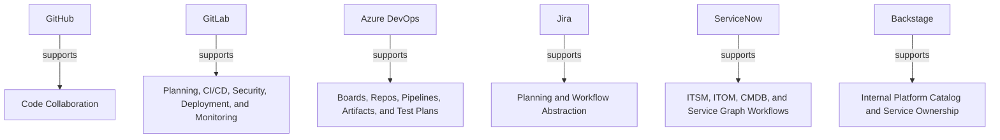

# Vendor Ecosystem Mapping

Vendor platforms should be modeled as abstraction-distortion layers over the enterprise graph.

## Ontology Nodes

### GitHub

- concept_type: technical_platform_abstraction
- abstraction_layer: engineering layer, governance layer, cross-cutting layer
- semantic_role: unified surface for source control, automation, security, and enterprise collaboration
- confidence: high
- status: vendor convention

### GitLab

- concept_type: technical_platform_abstraction
- abstraction_layer: engineering layer, operational layer, governance layer
- semantic_role: integrated software delivery surface spanning planning, code, CI/CD, security, deployment, and monitoring
- confidence: high
- status: vendor convention

### Azure DevOps

- concept_type: technical_platform_abstraction
- abstraction_layer: engineering layer, portfolio layer, governance layer
- semantic_role: integrated lifecycle tooling surface across work tracking, repos, pipelines, testing, and artifacts
- confidence: high
- status: vendor convention

### Jira

- concept_type: technical_platform_abstraction
- abstraction_layer: portfolio layer, product layer, engineering layer
- semantic_role: work management abstraction that often becomes the de facto representation of planning structures
- confidence: medium
- status: vendor convention

### ServiceNow

- concept_type: technical_platform_abstraction
- abstraction_layer: operational layer, governance layer, cross-cutting layer
- semantic_role: workflow and service-graph platform spanning ITSM, ITOM, CMDB, service mapping, and operational control
- confidence: high
- status: vendor convention

### Backstage

- concept_type: technical_platform_abstraction
- abstraction_layer: engineering layer, cross-cutting layer, infrastructure layer
- semantic_role: developer portal and internal platform surface for catalog, templates, documentation, and service ownership workflows
- confidence: medium
- status: vendor convention

## Semantic Edges

- github -> supports -> code collaboration, actions, security, and policy controls
- gitlab -> supports -> planning, CI/CD, security, deployment, infrastructure, and monitoring
- azure_devops -> supports -> boards, repos, pipelines, artifacts, and test plans
- jira -> supports -> planning and workflow abstraction
- servicenow -> supports -> ITSM, ITOM, CMDB, and service graph workflows
- backstage -> supports -> internal developer platform catalog and service ownership

## Competing Interpretations

- Vendor convention: each platform presents its integrated boundary as the natural lifecycle boundary.
- Practitioner convention: teams often let platform object models redefine enterprise semantics.
- Cross-vendor conflict: the same concept names map to different abstractions across tools.

## Historical Evolution

- Toolchains began as specialized point solutions.
- Platform suites expanded by absorbing adjacent functions to reduce integration burden and increase control.
- This consolidation improved operability but blurred conceptual distinctions between governance, lifecycle, methodology, and runtime control.

## Mermaid Diagram

## Reconstructed Claim

- These products are not neutral tools.
- They are opinionated abstraction layers over the enterprise graph.
- Much industry confusion comes from mistaking vendor boundaries for conceptual truth.

Related notes:

- [ITSM and ITIL](../07-itsm/itsm-itil.md)
- [ALM, SDLC, and DevOps](../05-lifecycle/alm-sdlc-devops.md)
- [Platform and infrastructure](../08-platform/platform-infrastructure.md)
- [Common misconceptions](../12-misconceptions/common-misconceptions.md)