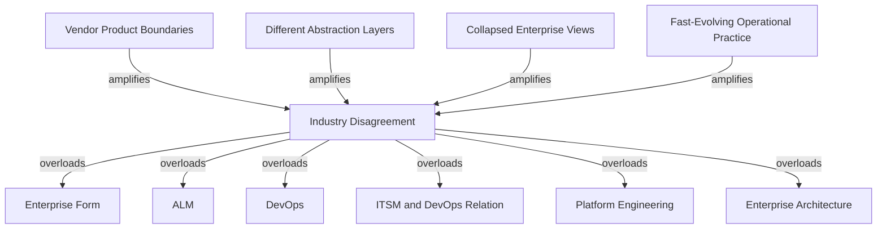

# Areas of Industry Disagreement

This section models disagreement as ontology instability rather than as simple opinion variance.

## Disputed Nodes

### Enterprise Form

- disputed_question: are enterprises primarily hierarchical, graph-shaped, layered, federated, or hybrid?
- confidence: high that the dispute exists
- status: strongly established

### ALM

- disputed_question: is ALM a superset lifecycle, a governance shell, or a vendor-suite label?
- confidence: high that the dispute exists
- status: strongly established

### DevOps

- disputed_question: is DevOps culture, operating model, methodology bundle, or tool category?
- confidence: high that the dispute exists
- status: strongly established

### ITSM and DevOps relation

- disputed_question: are ITSM and DevOps opposing models, overlapping layers, or converging control systems?
- confidence: high that the dispute exists
- status: strongly established

### Platform Engineering

- disputed_question: is platform engineering organizational design, software architecture, operating model, or product management?
- confidence: high that the dispute exists
- status: strongly established

### Enterprise Architecture

- disputed_question: is enterprise architecture a discipline, framework family, governance model, or documentation practice?
- confidence: high that the dispute exists
- status: strongly established

## Why the Conflict Persists

- vendors optimize for product boundaries, not ontology purity
- frameworks emphasize different abstraction layers
- enterprises collapse funding, governance, lifecycle, and dependency views into one diagram
- operational practice evolves faster than formal terminology

## Mermaid Diagram

## Reconstructed Claim

- Industry disagreement is not noise around one true definition.
- It is evidence that several concepts are overloaded across layers and relationship types.

Related notes:

- [Vendor ecosystem mapping](../10-vendors/vendor-ecosystem.md)
- [Unified semantic relationship model](../13-model/unified-semantic-relationship-model.md)