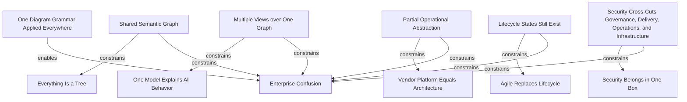

# Common Misconceptions

This section restates common errors as graph-model failures.

## Misconception Nodes

### Everything is a tree

- correction: hierarchy is only one edge family among many
- confidence: high
- status: strongly established

### One model explains all behavior

- correction: enterprises require multiple views over a shared semantic graph
- confidence: high
- status: strongly established

### Vendor platform equals architecture

- correction: a platform is a partial operational abstraction, not the ontology itself
- confidence: high
- status: strongly established

### Agile replaces lifecycle

- correction: Agile modifies work coordination and feedback, not the existence of lifecycle states
- confidence: high
- status: strongly established

### Security belongs in one box

- correction: security cross-cuts governance, lifecycle, operations, and infrastructure simultaneously
- confidence: high
- status: strongly established

## Mermaid Diagram

## Reconstructed Claim

- Most enterprise confusion comes from mapping one diagram grammar onto several different relationship systems.

Related notes:

- [Areas of industry disagreement](../11-disagreement/industry-disagreement.md)
- [Vendor ecosystem mapping](../10-vendors/vendor-ecosystem.md)
- [Unified semantic relationship model](../13-model/unified-semantic-relationship-model.md)