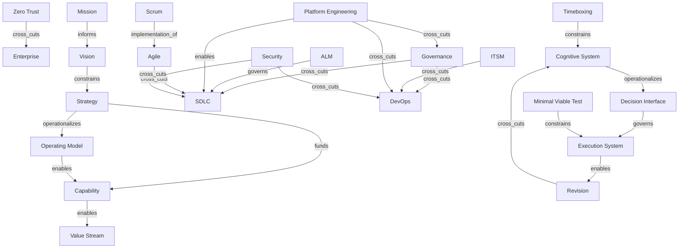

# Unified Semantic Relationship Model

This is the current machine-friendly model for the enterprise meta-model.

## Schema Rules

- Every concept must declare its concept_type.
- Every concept must declare its primary abstraction_layer.
- Every concept must declare its edge semantics instead of relying on implied nesting.
- Every major claim should carry a confidence marker.
- Competing interpretations should be preserved instead of averaged away.
- Edge direction should be expressed in active form from source to target.
- Page-local decompositions may add explanatory nodes, but the canonical edge vocabulary should remain stable across pages.

## Node Types

- intent: mission, vision, strategy, goals
- structure: org units, capabilities, value streams, products, platforms
- governance: policy, risk, compliance, review boards, audit
- lifecycle: ALM, SDLC, DevOps, ITSM, delivery methods
- technology: applications, infrastructure, runtime, identity, observability
- vendor: GitHub, GitLab, Azure DevOps, ServiceNow, Backstage
- cognitive-control: observation, framing, abstraction, inference, design, decision interface, feedback, revision

## Edge Types

- informs
- governs
- funds
- enables
- executes
- depends_on
- cross_cuts
- lifecycle_for
- methodology_for
- constrains
- platform_for
- operationalizes
- automates
- audits
- secures
- monitors
- supports
- implementation_of

## Directional Convention

- `A -> informs -> B` means A shapes the interpretation of B.
- `A -> constrains -> B` means A limits the acceptable state or action space of B.
- `A -> governs -> B` means A has explicit control authority over B.
- `A -> cross_cuts -> B` means A applies across B without implying subordination.
- `A -> operationalizes -> B` means A turns B into executable or repeatable practice.
- `A -> enables -> B` means A increases B's feasible execution capacity.

## Concept Card Template

```yaml
concept: example_concept
concept_type: intent | structure | governance | lifecycle | technology | vendor | cognitive-control
subtype: mission | strategy | capability | policy | framework | operating_model | architecture_domain | organizational_function | execution_process | management_discipline | technical_platform_abstraction | methodology | cultural_philosophy
abstraction_layer: strategic | governance | portfolio | product | engineering | operational | infrastructure | organizational | cross_cutting
semantic_edges:
  informs: []
  governs: []
  enables: []
  executes: []
  cross_cuts: []
  constrains: []
  operationalizes: []
  automates: []
  funds: []
  audits: []
  depends_on: []
  methodology_for: []
  lifecycle_for: []
  implementation_of: []
competing_interpretations: []
historical_origin: ""
vendor_distortion: []
confidence: high | medium | low
status: strongly established | industry convention | vendor convention | disputed
```

## Draft Graph

```yaml
nodes:
  - id: enterprise
    type: system
  - id: mission
    type: intent
  - id: vision
    type: intent
  - id: strategy
    type: intent
  - id: operating_model
    type: structure
  - id: capability
    type: structure
  - id: value_stream
    type: structure
  - id: governance
    type: governance
  - id: alm
    type: governance
  - id: devops
    type: lifecycle
  - id: sdlc
    type: lifecycle
  - id: itsm
    type: lifecycle
  - id: agile
    type: lifecycle
  - id: scrum
    type: lifecycle
  - id: platform_engineering
    type: technology
  - id: security
    type: governance
  - id: zero_trust
    type: governance
  - id: cognitive_system
    type: cognitive-control
  - id: decision_interface
    type: cognitive-control
  - id: execution_system
    type: cognitive-control
  - id: revision
    type: cognitive-control
  - id: timeboxing
    type: governance
  - id: minimal_viable_test
    type: cognitive-control
edges:
  - from: mission
    to: vision
    type: informs
  - from: vision
    to: strategy
    type: constrains
  - from: strategy
    to: operating_model
    type: operationalizes
  - from: strategy
    to: capability
    type: funds
  - from: operating_model
    to: capability
    type: enables
  - from: capability
    to: value_stream
    type: enables
  - from: governance
    to: sdlc
    type: cross_cuts
  - from: governance
    to: devops
    type: cross_cuts
  - from: alm
    to: sdlc
    type: governs
  - from: platform_engineering
    to: sdlc
    type: enables
  - from: platform_engineering
    to: governance
    type: cross_cuts
  - from: zero_trust
    to: enterprise
    type: cross_cuts
  - from: agile
    to: sdlc
    type: cross_cuts
  - from: scrum
    to: agile
    type: implementation_of
  - from: itsm
    to: devops
    type: cross_cuts
  - from: platform_engineering
    to: devops
    type: cross_cuts
  - from: security
    to: sdlc
    type: cross_cuts
  - from: security
    to: devops
    type: cross_cuts
  - from: cognitive_system
    to: decision_interface
    type: operationalizes
  - from: decision_interface
    to: execution_system
    type: governs
  - from: execution_system
    to: revision
    type: enables
  - from: revision
    to: cognitive_system
    type: cross_cuts
  - from: timeboxing
    to: cognitive_system
    type: constrains
  - from: minimal_viable_test
    to: execution_system
    type: constrains
```

## Mermaid Diagram



## Cross-Domain Master Map

- [Enterprise master map](../15-master-map/enterprise-master-map.md)

## Current conclusion

- The enterprise is best modeled as a hybrid of graph and layers.
- Trees are useful for ownership or reporting views, but they are not sufficient as the master model.
- The model must preserve semantic edge types, not merely containment.
- The enterprise graph also requires a cognitive-execution loop so that model formation, decision compression, action, and revision are represented as first-class control structures.