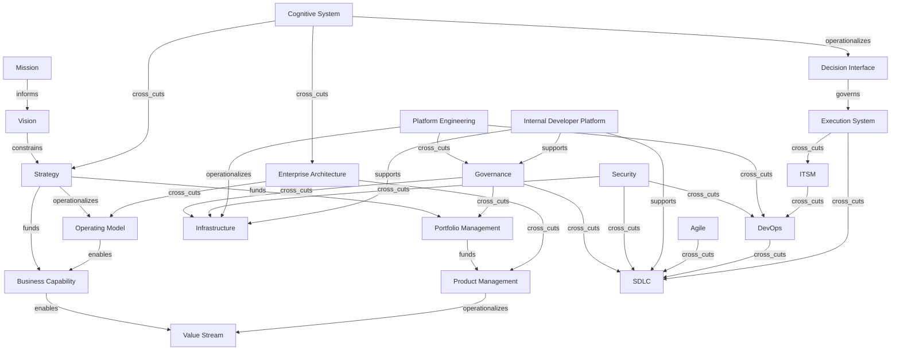

# Enterprise Master Map

This page consolidates the domain research into one cross-domain Mermaid map.

## Scope

- The map preserves graph edges instead of collapsing everything into hierarchy.
- The map focuses on cross-domain links already supported by the research pages.
- Vendor products are treated as abstraction surfaces, not as the ontology itself.

## Mermaid Diagram

## Cross-Domain Reading Order

1. Mission, strategy, and operating model set intent and allocation logic.
2. Capability, value stream, portfolio, and product nodes translate intent into delivery ownership and flow.
3. Architecture, governance, security, and platform nodes cross-cut delivery rather than sit beneath it.
4. SDLC, DevOps, ITSM, and Agile shape how work moves and how change is controlled.
5. The cognitive loop explains how enterprise knowledge becomes action and how action revises the model.

## Related Notes

- [Enterprise foundations](../01-foundations/enterprise-foundations.md)
- [Enterprise architecture](../02-architecture/enterprise-architecture.md)
- [Governance graph](../03-governance/governance-graph.md)
- [Portfolio, product, and program relationships](../04-portfolio-product-program/portfolio-product-program.md)
- [ALM, SDLC, and DevOps](../05-lifecycle/alm-sdlc-devops.md)
- [Agile and delivery methodologies](../06-methodologies/agile-scrum-kanban-safe.md)
- [ITSM and ITIL](../07-itsm/itsm-itil.md)
- [Platform and infrastructure](../08-platform/platform-infrastructure.md)
- [Security cross-cutting layer](../09-security/security-cross-cutting.md)
- [Unified semantic relationship model](../13-model/unified-semantic-relationship-model.md)
- [Knowledge, action, and revision loop](../14-cognitive-execution-loop/knowledge-action-loop.md)